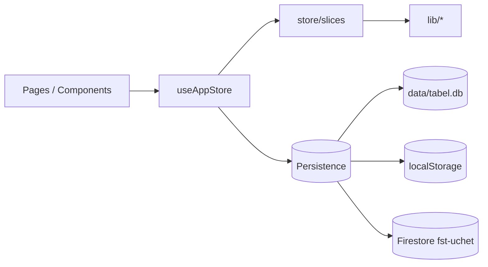

# Архитектура FiberCell — Табель

## Обзор

Монорепозиторий с двумя приложениями:

| Пакет | Назначение | Запуск |
|-------|------------|--------|
| **корень** (`tabel`) | Локальное ПО завода | `npm run dev` |
| **fst-web/** | Облачная версия (Vercel + Firebase) | `npm run dev:fst-web` |

## Слои приложения

```
src/
├── pages/              # Экраны (Month, Warehouse, Planner, …)
├── components/         # UI по доменам (month/, warehouse/, directories/)
├── hooks/
│   └── useAppStore.ts  # Тонкий композитор состояния
├── store/              # Доменные slices (бизнес-действия)
│   ├── storeApi.ts
│   └── slices/
│       ├── timesheetSlice.ts
│       ├── hrSlice.ts
│       ├── warehouseSlice.ts
│       ├── productionSlice.ts
│       ├── directoriesSlice.ts
│       ├── settingsSlice.ts
│       └── workspaceSlice.ts
├── lib/                # Чистая логика без React
│   ├── types.ts        # AppStore v6, сущности табеля
│   ├── storage.ts      # localStorage load/save
│   ├── persistence/    # Режимы хранения, BroadcastChannel, черновики
│   ├── localDb/        # Клиент SQLite API
│   ├── warehouse/
│   ├── planner/
│   ├── production/
│   └── formulations/
└── server/             # Express + better-sqlite3 (:3847)
```

## Поток данных



## Режимы хранения

Определяются в `src/lib/persistence/modes.ts`:

| Режим | Условие | Файл / ключ |
|-------|---------|-------------|
| **sqlite** | `VITE_LOCAL_DB=true` (по умолчанию) | `data/tabel.db` |
| **localStorage** | `VITE_LOCAL_DB=false` | `fibercell-tabel-v6` |
| **firestore** | `VITE_FST_WEB=true` | Firebase `fst-uchet` |

`npm run dev` запускает SQLite-сервер и Vite одновременно (`concurrently`).

## Store slices

Каждый slice — фабрика `createXxxSlice({ setStore, getStore })`, возвращающая объект действий.
`useAppStore` собирает slices через `useMemo` и отдаёт единый API в `App.tsx`.

Добавление нового домена:

1. Типы в `lib/<domain>/types.ts`
2. Логика в `lib/<domain>/`
3. Slice в `store/slices/<domain>Slice.ts`
4. Подключение в `useAppStore.ts` и `store/index.ts`

## Модули по назначению

| Модуль | Ответственность |
|--------|-----------------|
| **Табель** | `timesheetSlice`, `lib/monthSheet`, `lib/bulkOps` |
| **Кадры** | `hrSlice`, `lib/hr/` |
| **Склад** | `warehouseSlice`, `lib/warehouse/` |
| **Планировщик / производство** | `productionSlice`, `lib/planner/`, `lib/production/` |
| **Справочники** | `directoriesSlice`, counterparties, formulations, packaging |
| **Рабочий стол** | `workspaceSlice`, черновики в `sessionStorage` |

## Синхронизация SQLite

`LocalDbSync.tsx`:

- debounce сохранения ~400 ms
- poll каждые 3 s (другие вкладки / браузеры на том же ПК)
- `BroadcastChannel` для мгновенного обновления между вкладками
- индикатор «сохранено в HH:MM:SS»

## Известные ограничения

- Firestore: один JSON-документ на пользователя (~1 MB)
- Нет ролей и multi-user conflict resolution (last-write-wins)
- Производство → склад: автоприход ГП не связан
- `AppStore` v6 — один blob; долгосрочно — разбить коллекции Firestore
