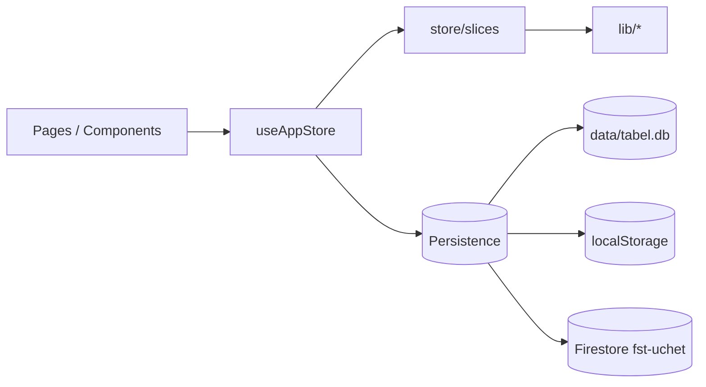
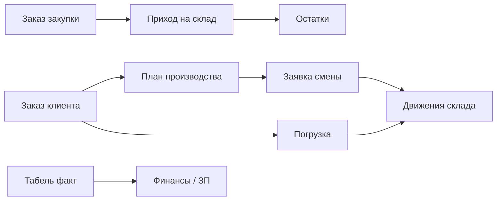

# Архитектура FiberCell — ERP учёт

## Обзор

Монорепозиторий с двумя приложениями:

| Пакет | Назначение | Запуск |
|-------|------------|--------|
| **корень** (`tabel`) | Локальное ПО завода | `npm run dev` |
| **fst-web/** | Облачная версия (Vercel + Firebase) | `npm run dev:fst-web` |

Единый **AppStore v6** — JSON-blob со всеми доменами (табель, склад, производство, закупки, финансы, продажи, доступ). UI собирает данные через `useAppStore` и slices; чистая логика — в `lib/`.

## Слои приложения

```
src/
├── pages/              # Экраны (Month, Warehouse, Finance, Journals, …)
├── components/         # UI по доменам (month/, warehouse/, finance/, …)
├── hooks/
│   └── useAppStore.ts  # Композитор store + persistence
├── store/              # Доменные slices (бизнес-действия)
│   ├── storeApi.ts
│   └── slices/         # 22 slice — см. таблицу ниже
├── lib/                # Чистая логика без React
│   ├── types.ts        # AppStore v6, AuditEntry
│   ├── storage.ts      # localStorage load/save, normalizeV6Store
│   ├── journals/       # Единая лента журналов + classifyAudit
│   ├── access/         # Роли, права, web views
│   ├── finance/        # Авансы, выплаты, расчёт из табеля
│   ├── procurement/    # Заказы поставщикам, приёмка → склад
│   ├── sales/          # Заказы клиентов → план → погрузка
│   ├── warehouse/      # Документы, движения, погрузка
│   ├── production/     # Заявки смены, проводка в склад
│   ├── planner/        # Производственные заказы
│   └── formulations/   # Рецептуры, замесы
└── server/             # Express + better-sqlite3 (:3847)
```

## Store slices (22)

| Slice | Ответственность |
|-------|-----------------|
| `timesheetSlice` | Табель: план/факт, перекличка, закрытие месяца |
| `hrSlice` | Сотрудники, оргструктура, audit HR |
| `candidatesSlice` | Воронка кандидатов → приём |
| `financeSlice` | Авансы, выплаты, премии, больничные |
| `warehouseSlice` | Номенклатура, документы, движения, погрузка |
| `productionSlice` | Заявки смены, резервы, проводка в склад |
| `procurementSlice` | Заказы закупки, приёмка |
| `salesSlice` | Заказы клиентов, план, погрузка |
| `directoriesSlice` | Контрагенты, ГП, рецептуры, упаковка |
| `accessSlice` | Пользователи, роли, права |
| `settingsSlice` | Настройки, месяцы, audit закрытия |
| `workspaceSlice` | Рабочий стол, черновики |
| `workwearSlice` | Спецодежда |
| `itOfficeSlice` | IT Office (активы, выдача) |
| `formulationBatchSlice` | Замесы технолога |
| `mixTasksSlice` | Задачи смешения |
| `technologistQcSlice` | Контроль качества |
| `wastewaterSlice` | Стоки |
| `aiChatSlice` | AI-чат |

Подключение: `store/index.ts` → `useAppStore.ts` → `App.tsx`.

## Поток данных



## Цепочки документов ERP



| Связь | Реализация |
|-------|------------|
| Закупка → склад | `procurement/receive.ts` → `postWarehouseDocument`, `warehouseDocumentIds` на заказе |
| Производство → склад | `production/postToWarehouse.ts` → движения + `warehouse.auditLog` с `productionRequestId` |
| Продажи → план | `salesSlice.planSalesLine` → `production.planner.orders` |
| Продажи → погрузка | `sales/loadingLink.ts` → `warehouse.loadingShipments` |
| Табель → финансы | `finance/calc.ts` читает факт из `months` |

## Журналы и аудит (dual-log)

| Журнал | Лимит | Что пишет |
|--------|-------|-----------|
| `store.auditLog` | 500 | Табель, финансы, HR, доступ, справочники |
| `warehouse.auditLog` | 300 | Документы, движения, погрузка, проводка производства |

Классификация глобального audit: `lib/journals/classifyAudit.ts` → категории `timesheet`, `finance`, `hr`, `access`, `directories`, …

Сборка ленты: `lib/journals/collect.ts` → `JournalsPage`. Навигация к первоисточнику: `lib/journals/navigate.ts`.

При приёмке закупки запись `statusHistory` содержит `warehouseDocumentId` — журнал открывает приходный документ напрямую.

## Режимы хранения

| Режим | Условие | Хранилище |
|-------|---------|-----------|
| **sqlite** | `VITE_LOCAL_DB=true` | `data/tabel.db` |
| **localStorage** | `VITE_LOCAL_DB=false` | `fibercell-tabel-v6` |
| **firestore** | `VITE_FST_WEB=true` | Firebase `fst-uchet` |

## Доступ и права

- 11 ролей (`lib/access/types.ts`), матрица view — `roleViews` + per-user `webViews`
- `roleAllowNegativeStock[roleId]` — разрешение проводить при отрицательном остатке (`permissions.ts`)
- `roleAllowDocumentCancel` — отмена документов; снятие проведения — только sysadmin

## Добавление нового домена

1. Типы в `lib/<domain>/types.ts`
2. Логика в `lib/<domain>/`
3. Slice в `store/slices/<domain>Slice.ts`
4. Подключение в `useAppStore.ts`, `store/index.ts`
5. При необходимости — категория в `journals/` + `appendAudit`

## Известные ограничения

- Firestore: один JSON-документ на пользователя (~1 MB), last-write-wins
- `AppStore` v6 — монолит; долгосрочно — разбить коллекции Firestore по доменам
- Крупные таблицы (табель, журналы) без виртуализации — см. `specs/001-erp-coherence/tasks.md` Phase C

## Спецификации

ERP coherence roadmap: `specs/001-erp-coherence/` (spec, plan, tasks). Constitution: `.specify/memory/constitution.md`.
